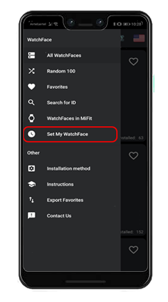
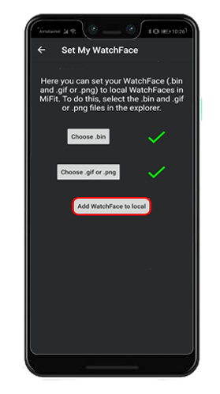
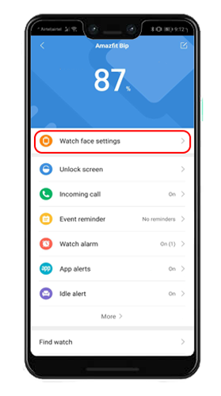
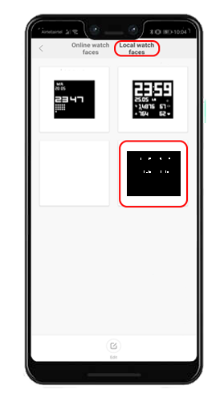

Custom minimal watch face for Amazfit Bip by Xiaomi.

Tool: AmazfitBipTools-1.0.3.1 > WatchFace.exe

You may use My WatchFace(https://play.google.com/store/apps/details?id=dev.rokitskiy.wfab&hl=en&gl=US) and 
Mi Fit(https://play.google.com/store/apps/details?id=com.xiaomi.hm.health&hl=en&gl=US) to install by hand.

